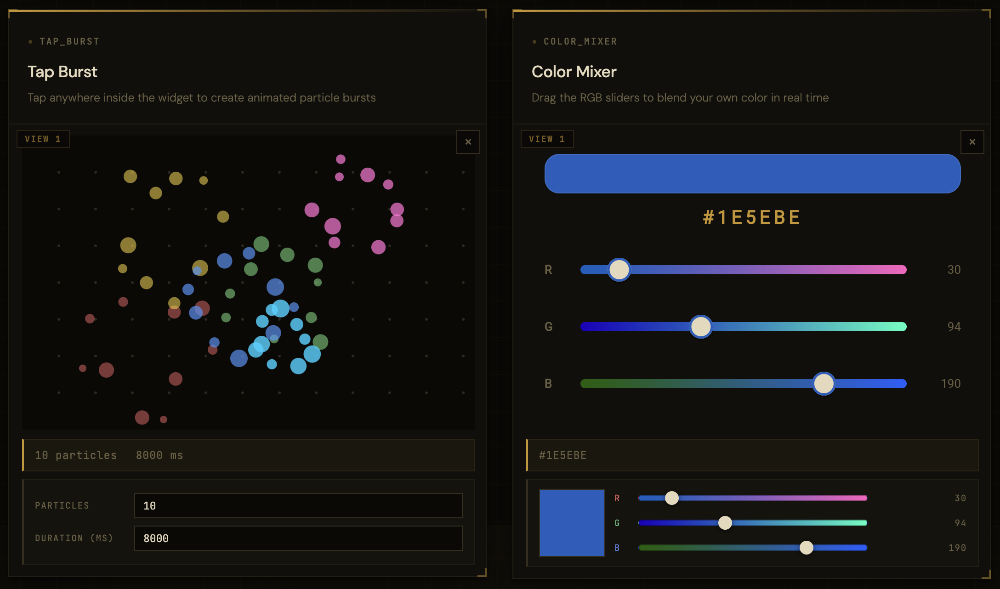

# Flutter Multi View Web Embedding

A monorepo that demonstrates embedding multiple independent Flutter widgets in a single HTML page using Flutter's multi-view web API. It contains reusable Flutter packages, two Flutter web component apps, and a Vite + TypeScript host page that mounts both widgets side by side.



---

## Repository structure

```
flutter_multi_view_web_embedding/
├── packages/
│   ├── flutter_bootstrap/          # Build target that produces flutter_bootstrap.js
│   ├── multi_view_app/             # Root widget for multi-view Flutter apps
│   ├── color_mixer/                # Interactive RGB color-mixer Flutter widget
│   └── tap_burst/                  # Animated particle-burst Flutter widget
├── apps/
│   ├── color_mixer_web_component/  # Flutter web app wrapping the color_mixer widget
│   ├── tap_burst_web_component/    # Flutter web app wrapping the tap_burst widget
│   └── widgets_preview/            # Vite + TypeScript host page (the live demo)
└── docs/
    └── embedding.md                # Full embedding API reference
```

---

## Getting started

**Prerequisites:** [Flutter](https://docs.flutter.dev/get-started/install) (managed via [FVM](https://fvm.app)), Node.js 18+.

```sh
# 1. Install Dart/Flutter package dependencies across all packages and apps
node tool/flutter-mono.mjs run bootstrap

# 2. Install Node dependencies for the host page
cd apps/widgets_preview
npm install

# 3. Build the Flutter web components and start the Vite dev server
npm start
```

The dev server starts at `http://localhost:3000`.

To produce an optimised production bundle instead, run `npm run build` from `apps/widgets_preview`. Output is written to `apps/widgets_preview/dist/`.

---

For the full embedding API reference — bootstrap phases, loader options, race-condition prevention, hosting considerations, and more — see [docs/embedding.md](docs/embedding.md).
