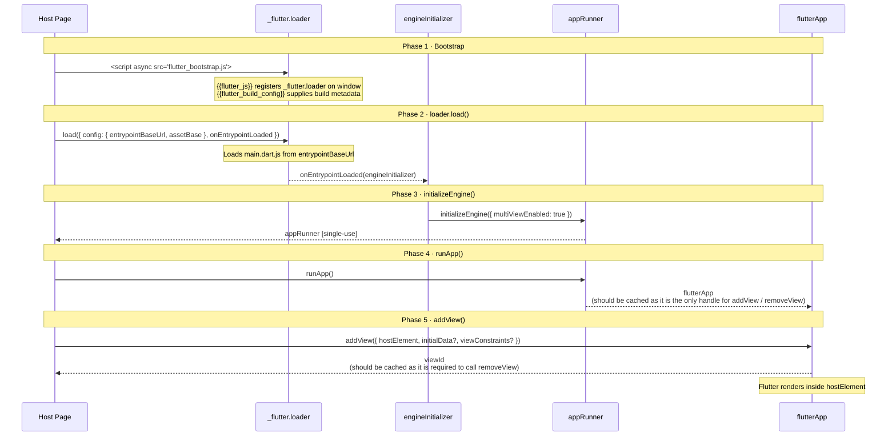
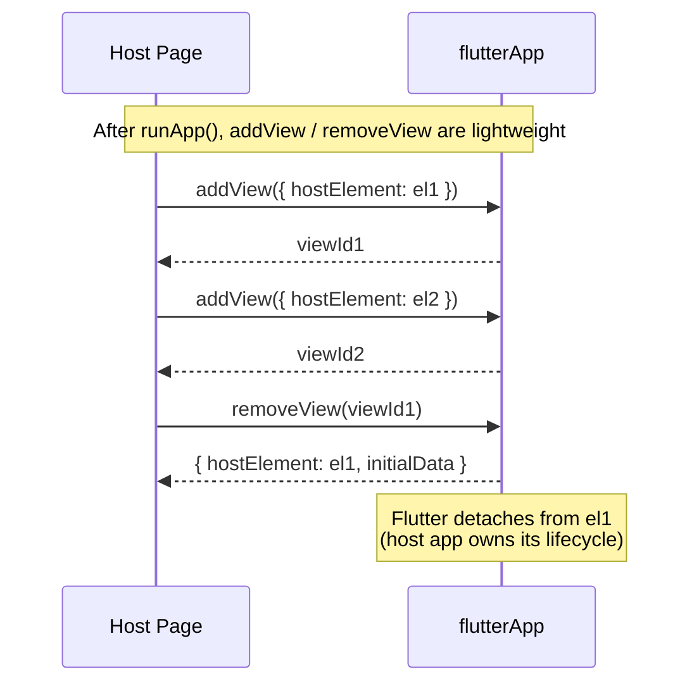
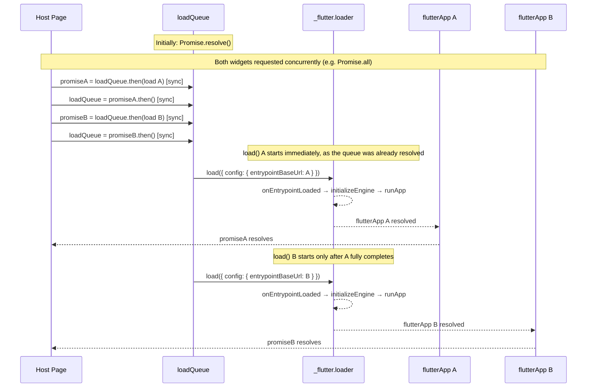

# Embedding guide

## Phase 1 · Bootstrap

Add `flutter_bootstrap.js` to your page via an `async` `<script>` tag. The file must contain two template placeholders that are resolved at build time:

| Placeholder | Purpose |
|---|---|
| `{{flutter_js}}` | Registers `_flutter.loader` on the global `window` object |
| `{{flutter_build_config}}` | Supplies build metadata required by the loader |

If you need a custom bootstrap (e.g. to show a loading indicator or read URL params), place your own `flutter_bootstrap.js` in `web/`. Both placeholders must still be present.

---

## Phase 2 · `_flutter.loader.load()`

Call `_flutter.loader.load()` with an `onEntrypointLoaded` callback to kick off the initialisation pipeline. No Flutter content is rendered until you complete the remaining steps inside that callback.

Options available in the `config` object passed to `_flutter.loader.load()`:

| Option | Type | Purpose |
|---|---|---|
| `entrypointBaseUrl` | `String` | Base URL of the Flutter app entrypoint. Defaults to `"/"`. |
| `assetBase` | `String` | Base URL for Flutter assets. Required when assets are served from a CDN or a different path than the page. |
| `renderer` | `String` | Force a specific renderer: `"canvaskit"` or `"skwasm"`. |
| `forceSingleThreadedSkwasm` | `bool` | Forces single-threaded rendering. Use this if `SharedArrayBuffer` is unavailable (see [Skwasm note](#skwasm--webassembly-renderer)). |
| `canvasKitBaseUrl` | `String` | Override the URL from which CanvasKit WASM is downloaded. Useful when self-hosting assets. |
| `canvasKitVariant` | `String` | CanvasKit build variant: `"auto"`, `"full"`, or `"chromium"`. |

---

## Phase 3 · `engineInitializer.initializeEngine()`

The `onEntrypointLoaded` callback receives an `engineInitializer` object. Call `initializeEngine()` on it with `multiViewEnabled: true` to activate embedded mode:

```js
const appRunner = await engineInitializer.initializeEngine({
  multiViewEnabled: true,
});
```

---

## Phase 4 · `appRunner.runApp()`

Call `runApp()` to start the app. In multi-view mode, nothing is rendered yet since no view has been attached.

```js
const flutterApp = await appRunner.runApp();
```

⚠️ **Cache the returned `flutterApp` object.** It is the only handle for adding and removing views. Losing it means views cannot be managed without a full page reload.

---

## Phase 5 · `flutterApp.addView()`

Attach Flutter to a host DOM element:

```js
const viewId = app.addView({
  hostElement: document.querySelector('#host-div'), // required
  initialData: { /* any JS object */ },             // optional
  viewConstraints: {                                // optional
    maxWidth: 320,
    minHeight: 0,
    maxHeight: Infinity,
  },
});
```

| Parameter | Required | Notes |
|---|---|---|
| `hostElement` | Yes | Any `HTMLElement`. Flutter renders inside it. |
| `initialData` | No | Any JS object. Passed into the widget at startup. |
| `viewConstraints` | No | Controls layout within `hostElement`. Must be consistent with the element's CSS (Flutter will not reconcile contradictions). |

Each `addView` call returns a numeric `viewId`. Store it, as you'll need it to remove the view later.

### Initialization pipeline

Phases 1–5 for one Flutter widget, from bootstrap to first rendered view.



---

## Phase 6 · Dynamic view management

Add or remove views at any time after `runApp()`:

```js
// Add another view
const viewId2 = app.addView({ hostElement: anotherElement });

// Remove a view
const viewConfig = app.removeView(viewId);
// viewConfig contains { hostElement, initialData }, which may be useful for re-attaching later
```

When a view is removed, Flutter detaches from the DOM node but does not destroy it. The host app owns the element's lifecycle.



---

## Hosting considerations

### What to cache

| Object | Cache? | Notes |
|---|---|---|
| `_flutter.loader` | No | Already available globally after bootstrap. |
| `engineInitializer` | No | Single-use. Consumed by `initializeEngine()`. |
| `appRunner` | No | Single-use. Consumed by `runApp()`. |
| **`flutterApp`** | **Yes** | Only handle for `addView` / `removeView`. Store at module level. |
| **`viewId`** | **Yes, one per view** | Required to call `removeView`. |

> Store `flutterApp` and all active `viewId` values in a module-level variable or dedicated state object. Neither survives a page navigation.

### Race conditions

Concurrent calls to `_flutter.loader.load()`, for example from multiple Angular components mounting simultaneously, produce unpredictable results: widgets may be mounted in the wrong views, or the initialisation flow may fail entirely. The same applies to concurrent calls to `engineInitializer.initializeEngine()` inside the `onEntrypointLoaded` callback.

Three rules apply:

- `load()` calls must never run concurrently, even for different entry points. They must be sequentialised.
- Each unique app must only be initialised once. Concurrent callers for the same app must await the same in-flight promise rather than starting a new `load()`.
- A unique app is identified by the combination of `entrypointBaseUrl` and `assetBase`, both passed in the `config` object to `load()`. Both values together determine which entry point is loaded and where its assets are served from. Caching by either value alone is insufficient if they can differ independently.

The correct pattern combines a per-app promise cache (keyed on `entrypointBaseUrl + assetBase`) with a serial queue that ensures only one `load()` runs at a time:

```js
const flutterAppPromises = new Map();
let loadQueue = Promise.resolve();

function getFlutterApp(entrypointBaseUrl, assetBase) {
  const key = `${entrypointBaseUrl}::${assetBase}`;
  if (!flutterAppPromises.has(key)) {
    // Chain onto the queue so this load() starts only after
    // any in-flight load() for another entry point has finished.
    const promise = loadQueue.then(() => new Promise((resolve) => {
      _flutter.loader.load({
        config: { entrypointBaseUrl },
        onEntrypointLoaded: async (engineInitializer) => {
          const appRunner = await engineInitializer.initializeEngine({
            assetBase,
            multiViewEnabled: true,
          });
          resolve(await appRunner.runApp());
        },
      });
    }));
    // Store before any await so concurrent callers find it immediately.
    flutterAppPromises.set(key, promise);
    // Advance the queue to wait for this entry point's full init before
    // allowing the next load() to start.
    loadQueue = promise.then(() => {});
  }
  return flutterAppPromises.get(key);
}
```

This ensures `load()` calls are sequential across all entry points, while concurrent callers for the same app share one promise and never trigger a second `load()`.



---

### Deferred / lazy initialisation

`_flutter.loader.load()` is a plain async call, so you can defer the entire pipeline until any condition is met: user interaction, route activation, intersection observer, etc.

```js
// Example: only initialise Flutter when the host element enters the viewport
const observer = new IntersectionObserver(async ([entry]) => {
  if (!entry.isIntersecting) return;
  observer.disconnect();

  _flutter.loader.load({
    onEntrypointLoaded: async (engineInitializer) => {
      const appRunner = await engineInitializer.initializeEngine({ multiViewEnabled: true });
      flutterApp = await appRunner.runApp();
      flutterApp.addView({ hostElement: entry.target });
    }
  });
}, { threshold: 0.1 });

observer.observe(document.querySelector('#flutter-host'));
```

Key points:

- `initializeEngine()` and `runApp()` are the expensive steps. Defer them if the widget is not immediately visible.
- Once `runApp()` has been called, subsequent `addView` / `removeView` calls are lightweight.
- Each unique entry point can only be initialized once per page. Concurrent callers share one in-flight promise. When embedding multiple independent Flutter apps, use the serial queue pattern described in [Race conditions](#race-conditions).
- Lazy loading can be verified in Chromium DevTools: open the **Sources** tab before the deferral condition is met and confirm that the Flutter entry point assets (`main.dart.js`, WASM, etc.) are absent. They appear only after `_flutter.loader.load()` is called.

---

### Service Worker and asset caching

As of Flutter ~3.27 (early 2025), Flutter no longer ships a caching service worker. Asset caching is now handled entirely by the browser's standard HTTP cache, so **your server configuration matters**.

Recommended HTTP header strategy:

| File | Cache-Control |
|---|---|
| `index.html` / page hosting `flutter_bootstrap.js` | `no-cache` |
| `flutter_bootstrap.js` | `no-cache` |
| `flutter_service_worker.js` | `no-cache` |
| `main.dart.js`, WASM, fonts, assets | `max-age=31536000, immutable` (long-lived, content-hashed) |

If assets are served from a CDN or a path different from the page, set `assetBase` in the `config` object passed to `_flutter.loader.load()`.

---

### Skwasm / WebAssembly renderer

If the build uses the `skwasm` renderer, the page must be served with these HTTP headers, otherwise the renderer will fail or fall back silently:

```
Cross-Origin-Opener-Policy: same-origin
Cross-Origin-Embedder-Policy: require-corp
```

If you cannot set those headers, pass `forceSingleThreadedSkwasm: true` in the `config` object to opt out of the multi-threaded requirement.

---

### Deprecated APIs to avoid

| Deprecated | Replacement |
|---|---|
| `_flutter.loader.loadEntrypoint(...)` | `_flutter.loader.load(...)` |
| `var serviceWorkerVersion = null` in `index.html` | `{{flutter_service_worker_version}}` template token in `flutter_bootstrap.js` |
| Engine config via `window` properties | `config` object in `_flutter.loader.load()` |

---

References:

- [Flutter Docs | Adding Flutter to any web application](https://docs.flutter.dev/platform-integration/web/embedding-flutter-web)
- [Flutter Docs | Flutter web app initialization](https://docs.flutter.dev/platform-integration/web/initialization)
